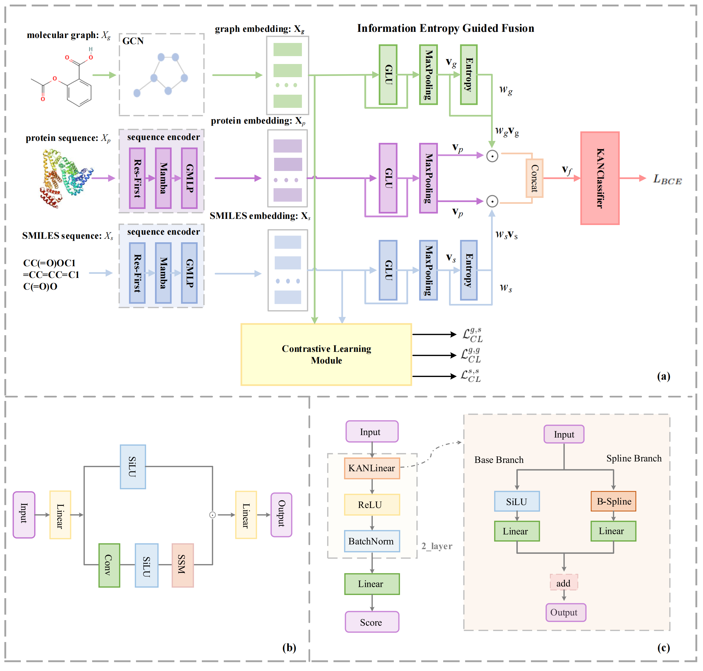

# IEGMCL:An Information Entropy Guided Multimodal Contrastive Learning Framework for Drug-target Interaction Prediction


## Introduction
This repository contains the PyTorch implementation of IEGMCL framework
## Framework

## System Requirements
The source code developed in Python 3.10 using PyTorch 2.1.0. The required python dependencies are given below. 

```
torch>=1.7.1
dgl>=0.7.1
dgllife>=0.2.8
numpy>=1.20.2
scikit-learn>=0.24.2
pandas>=1.2.4
prettytable>=2.2.1
rdkit~=2021.03.2
yacs~=0.1.8
```
## Installation Guide

To set up the environment and install the required dependencies for this project, follow these steps:

```
# Create a new conda environment
$ conda create -n IEGMCL python=3.10.13
$ conda activate IEGMCL

# install requried python dependencies
$ conda install cudatoolkit==11.8 -c nvidia
$ pip install torch==2.1.1 torchvision==0.16.1 torchaudio==2.1.1 --index-url https://download.pytorch.org/whl/cu118
$ conda install packaging
$ pip install causal-conv1d==1.1.1
$ pip install mamba_ssm-2.2.2+cu118torch2.4cxx11abiTRUE-cp310-cp310-linux_x86_64.whl
$ pip install prettytable
$ pip install yacs
```


## Datasets
$ The `human` dataset is used as an example and placed under the `datasets/` directory
$ To reduce the size of this GitHub repository, all datasets are hosted externally on Google Drive.
$ You can download the complete dataset collection from the following link:
🔗[Download Dataset from Google Drive]https://drive.google.com/drive/folders/1ZSgClfG8hzrZmvE-1UiaBz2OczYfECNh?usp=sharing
$ All datasets have already been pre-split into E1,E2,E3 and E4.After downloading, please unzip the file and place it in the following directory structure:
datasets/
├── human/
├── biosnap/
├── bindingdb/
└── celegans/

## Run  IEGMCL on Our Data to Reproduce Results

For experiments with vanilla IEGMCL, you can directly run the following command. `${dataset}` could either be `bindingdb`, `biosnap` , `human` and `celegans`.  ${split task}  could be E1,E2,E3 and E4. 

```
$ python main.py --data ${dataset} --split ${split task} 
```
The script will:

```
$ Load the dataset from `../datasets/<dataset>/<split>/`
$ Train and evaluate the model
$ Save results and configuration under:` outputs/<dataset>/<split>/`
```


